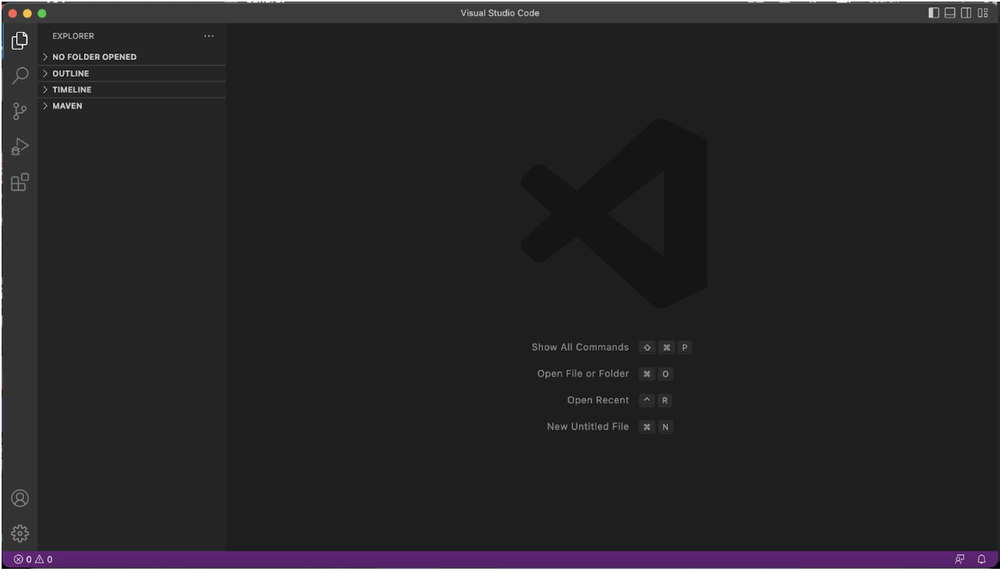
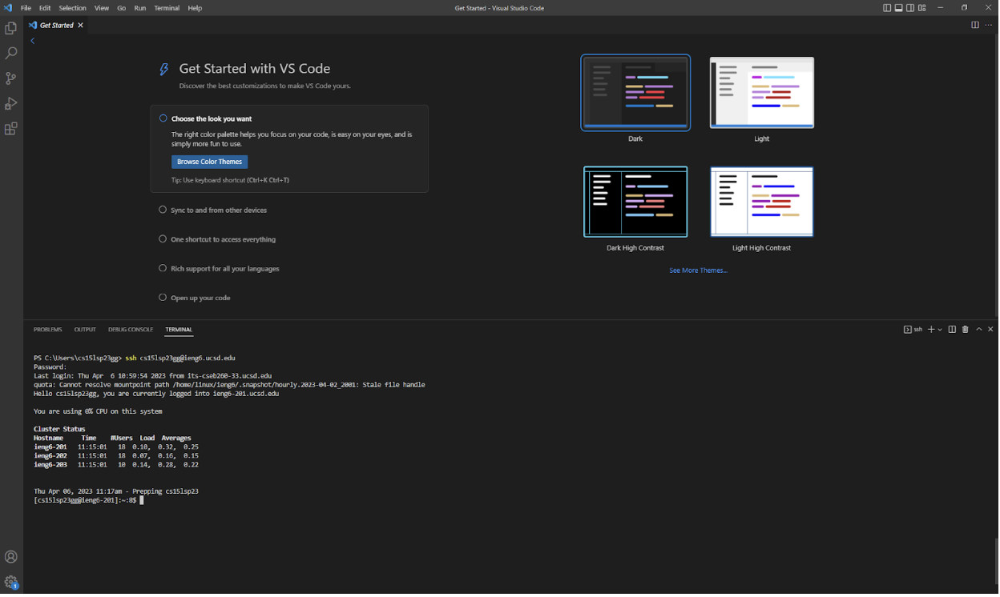
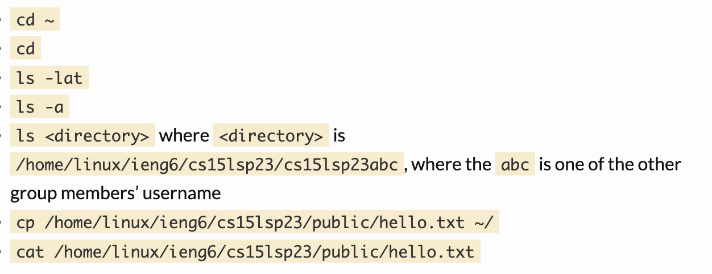
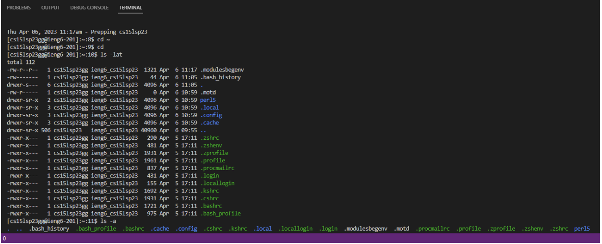

# Lab Report 1

## Step 1:
Look up your account on [this website](https://sdacs.ucsd.edu/~icc/index.php), after you have found your account for the class CS 15L you want to follow [this](https://drive.google.com/file/d/17IDZn8Qq7Q0RkYMxdiIR0o6HJ3B5YqSW/view) in order to reset your password.

## Step 2:
Download VS Code from [this website](https://code.visualstudio.com/) Just download the version for your operating system.
It should look like this 

## Step 3:
Because I am on a Mac I did not need to download git, but if you are on windows download git [here](https://gitforwindows.org/)

Open the terminal on VS Code on the top bar 

Then type in this **ssh cs15lsp23zz@ieng6.ucsd.edu** (replace the zz with whatever corresponds with your username from step 1)
Getting this message is normal:
⤇ ssh cs15lsp23zz@ieng6.ucsd.edu
The authenticity of host 'ieng6.ucsd.edu (128.54.70.227)' can't be established.
RSA key fingerprint is SHA256:ksruYwhnYH+sySHnHAtLUHngrPEyZTDl/1x99wUQcec.
Are you sure you want to continue connecting (yes/no/[fingerprint])? 

Type yes 

On your client it would show:
⤇ ssh cs15lsp23zz@ieng6.ucsd.edu
The authenticity of host 'ieng6-202.ucsd.edu (128.54.70.227)' can't be established.
RSA key fingerprint is SHA256:ksruYwhnYH+sySHnHAtLUHngrPEyZTDl/1x99wUQcec.
Are you sure you want to continue connecting (yes/no/[fingerprint])? 
Password: 

Type in your password from Step 1, it will not show anything while typing but it is typing

Once you are logged in it will look like this  with all of that stuff in the terminal.

## Step 4:
Try typing in commands like these 
Just typing directly into the terminal will give results like this 

All done, Command + D to exit and to log back in refer to step 3.
