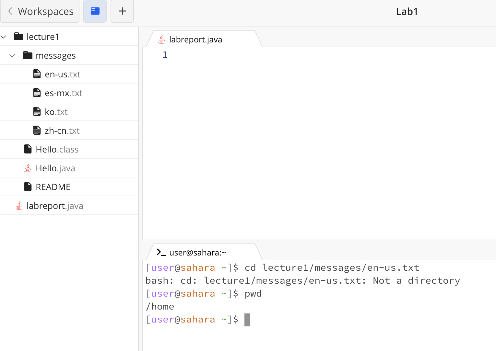
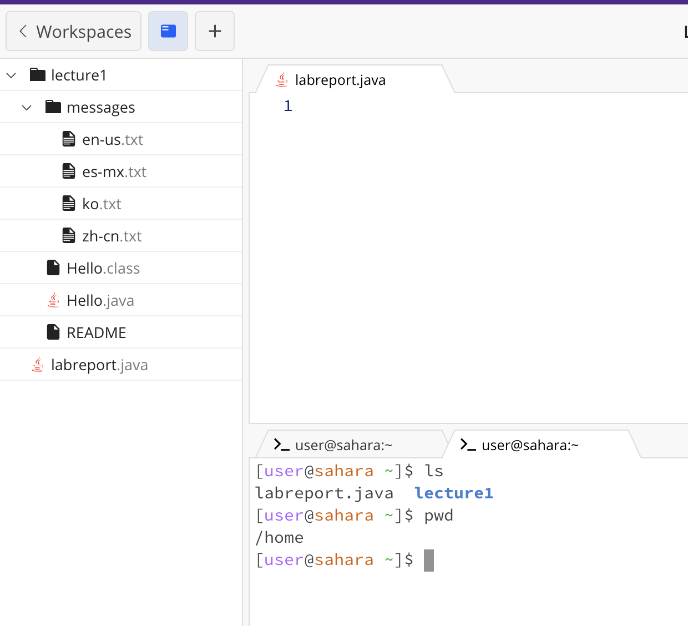
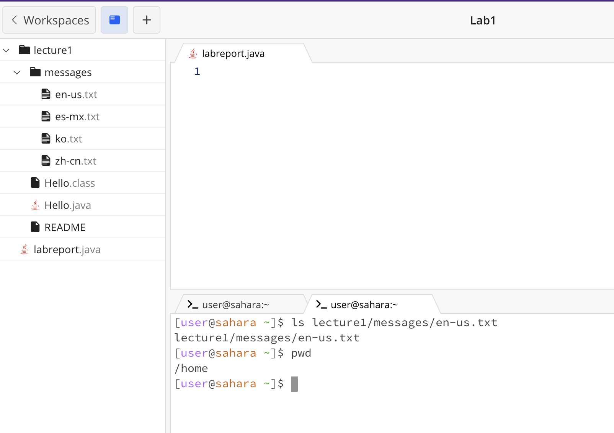
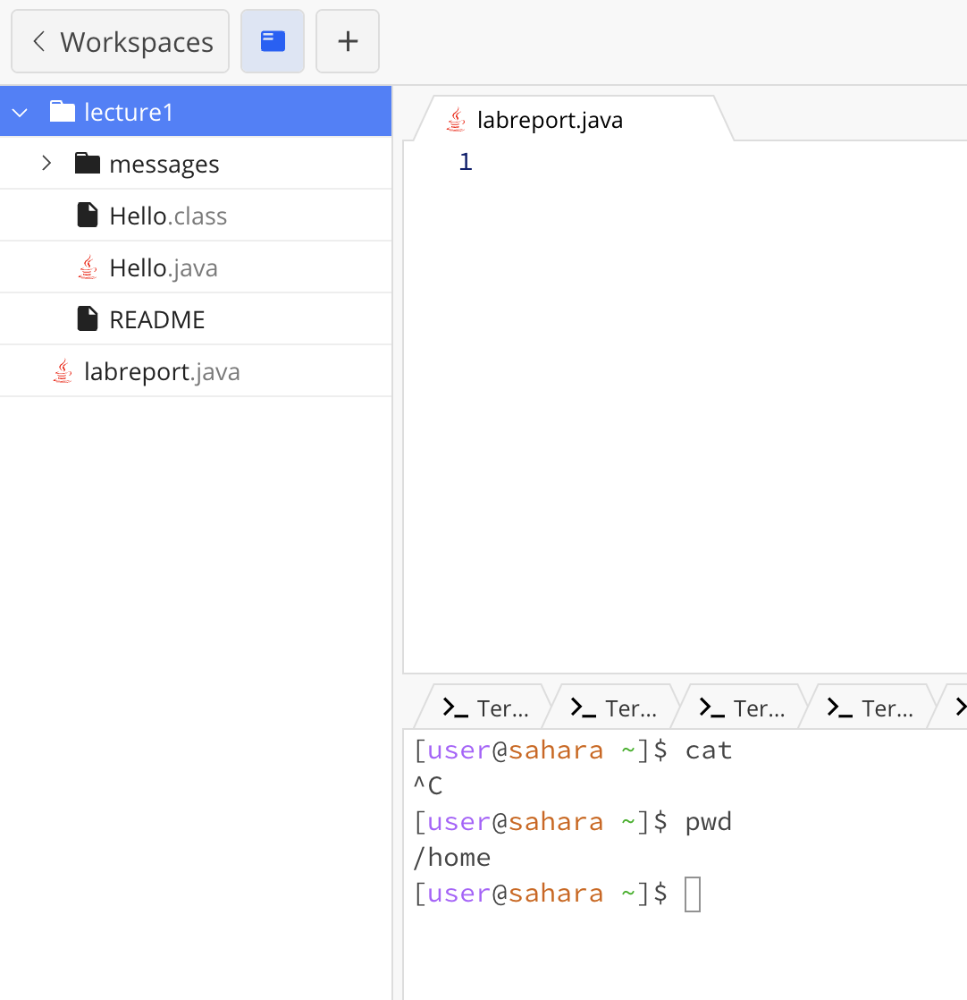
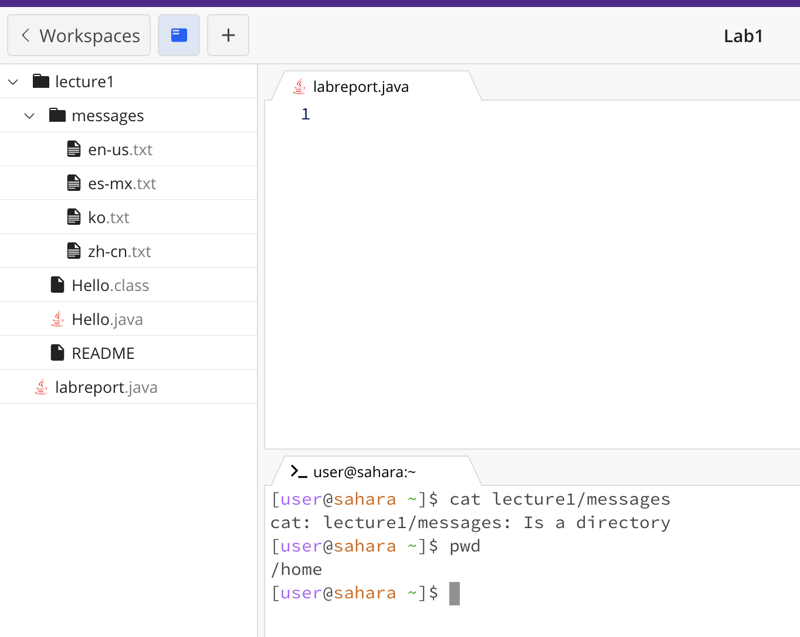
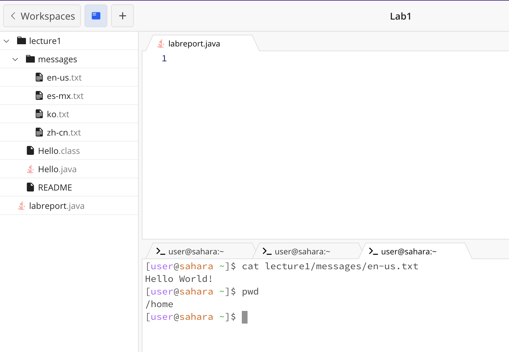

# **Lab Report 1 Roy Lee**

## cd

### No Arguments:
This shows that when cd is run without arguments, nothing happens and the working directory is still at home. When the working directory is now set to home/lecture1 running the cd command sends it back to the home directory this is not an error.

### Directory Argument:
When running the cd command to a directory it changes the working directory to the specified directory. In this case, the working directory changes to home/lecture1/messages. When the cd command is run again it brings the working directory back to home. This is not an error.

### File Argument:
There is an error that shows that the file is not a directory, you cannot change the directory to a file it was trying to do here the working directory is still at home because of the error.

## ls

### No Arguments:
When the working directory is still set at home with no arguments it lists all of the files in that current directory. The primary function of the ls command is to list files based on the current directory. This is not an error

### Directory Argument:
It shows all of the files that are in messages, it only shows the files that are available in home/lecture1/messages, and no directories are shown. The working directory is still set at home. This is not an error as it shows all of the files in the directory it was set to, home/lecture1/messages.

### File Argument:
It shows the path of the file argument and describes the past information of the file, which are messages and lecture1. Both the file and directories are shown. This is not an error as it shows the file and past directories.

## cat

### No Arguments:
Nothing is outputted and the working directory is still set at home. The cat argument is mainly used to read information from files so using it on the home directory does not output anything and leads to an error.

### Directory Argument:
Outputs that messages is a directory and that it was able to access and find it. The working directory is still at home. This is not an error and shows that home/lecture1/messages is an existent directory.

### File Argument:
Outputs the file contents in home/lecture1/messages/en-us.txt which is Hello World!. The working directory does not change and is at home. This is not an error as the cat function is to read file contents and output what is read.

