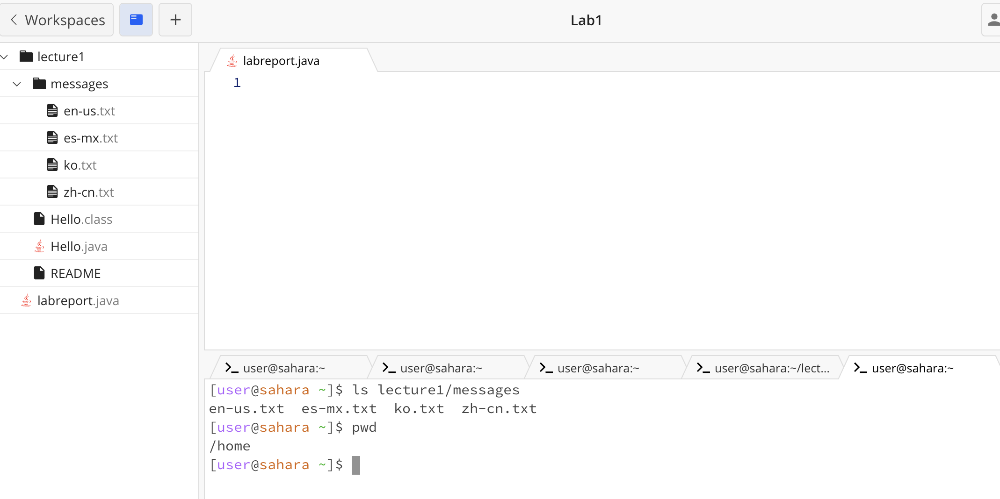

# **Lab Report 1 Roy Lee**

## cd

### No Arguments:
This shows that when cd is run with no arguments nothing happens and the working directory is still at home

### Directory Argument:
The directory that cd is led to is messages, when it is at messages the working directory is in the messages folder.

### File Argument:
There is an error that shows that the file is not a directory, you cannot change the directory to a file which it was trying to do here the working directory is still at home because of the error.

## ls

### No Arguments:
This shows that I am working in labreport.java and am in the lecture 1 folder. The working directory is set at home here.

### Directory Argument:
Shows all of the files that are in messages. The working directory is still set at home.

### File Argument:
It is the same as the directory argument where it just shows all of the available files in messages, while the working directory is still set at home.

## cat

### No Arguments:
Nothing is outputted and the working directory is not set, but the working directory is set at home.

### Directory Argument:
Outputs that messages is a directory and that it was able to access and find it. The working directory is still at home.

### File Argument:
Outputs the file that was in the messages directory which is Hello World!. The working directory does not change is at home.

