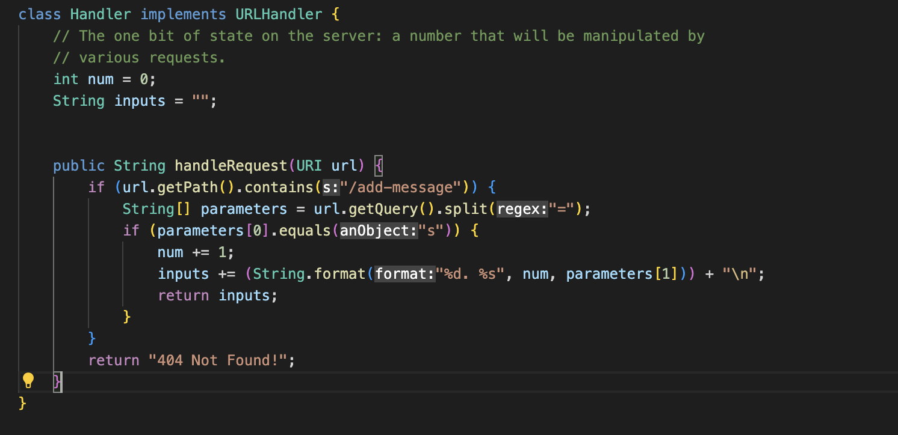
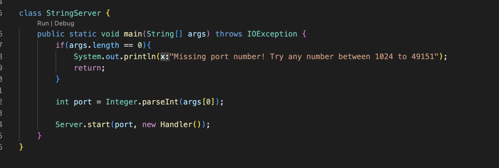
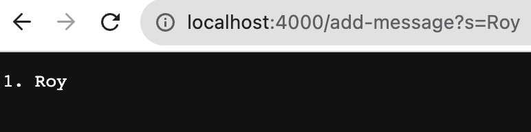
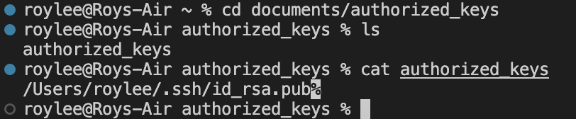
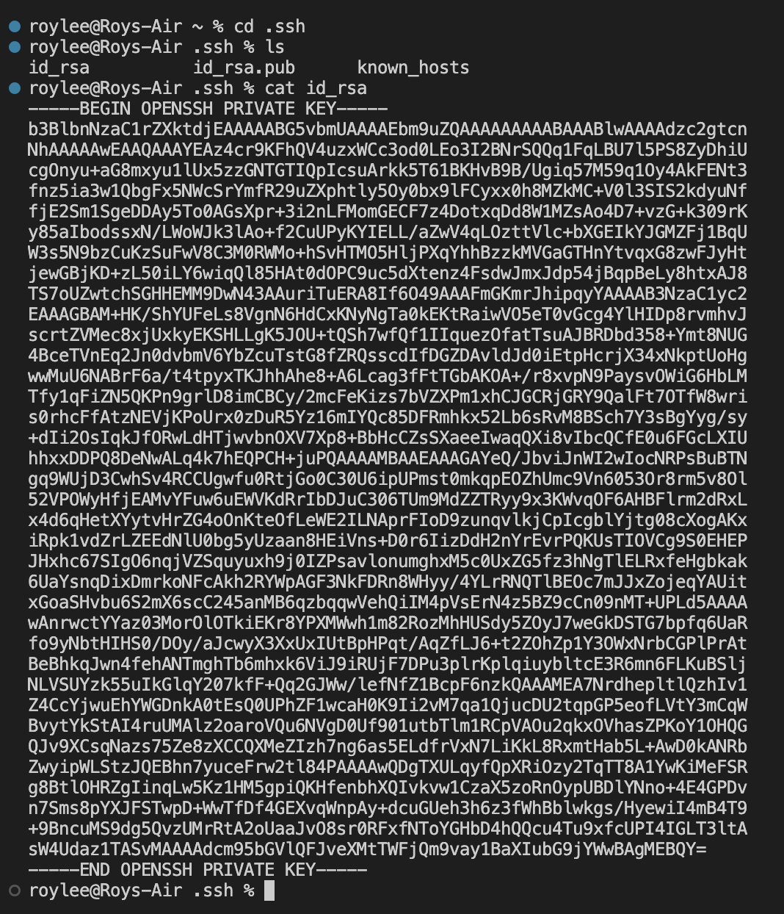
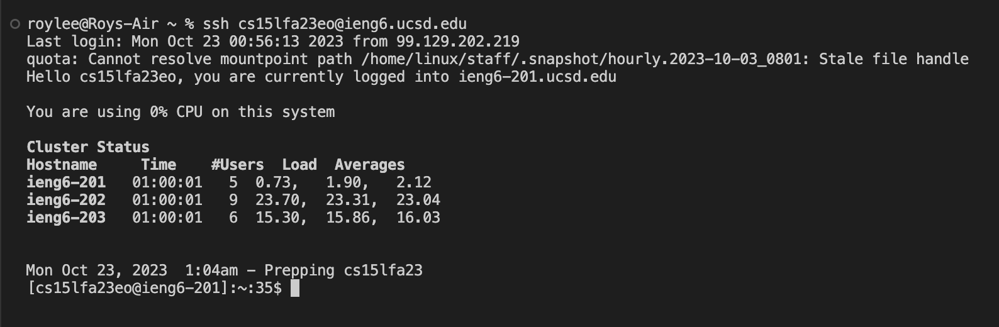

# **Lab Report 2 Roy Lee**

## Code

## Server

The methods that are being called are getPath and getQuery. In getPath, the if statement searches in the URL if the string /add-message is contained within the URL, if the string /add-message is found, the if statement moves onto the next line of code, if not "404 Not Found!" is outputted. If the first if statement's requirement is met the getQuery method is run which finds any of the inputs added to the URL past the ?. Then the list parameters split the input from both sides of the = where the first element of parameters should be an s while the second element is the input after the = and what is added to the search and outputted onto the page. The next if statement runs if the first element of parameters is s, num is incremented by 1 and keeps track of the amount of inputs, and inputs is updated and stored in the empty string. Lastly, inputs are returned with the updated num and the second element of parameters, or the user's search. In this case, the search was Roy, /add-message was found in the URL path satisfying the first if statement, and the s was found after the ? satisfying the second if statement and the = was able to split the query and store the message Roy into the list of parameters, therefore a successful output of the search was run. Roy is now stored in inputs and the second search of Roy Lee CSE 15L was inserted into the URL path and was properly shown on the page.

## SSH Keys
# Public Key

# Private Key

# No Key

## Labs 2 and 3
What I have learned from these two labs was to set up my own server. Before these two weeks, I was not able to run my own server or even know anything about it. I was not very familiar with my own terminal and did not even know what localhost was. I learned about ports, how to add specific queries to a URL path, and how to update them on my own server. 
