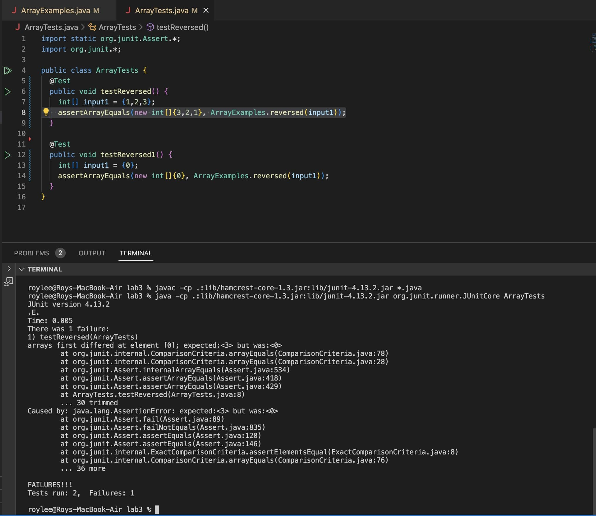

# **Lab Report 3 Roy Lee**

## Bugs
### Failure-inducing input
``` 
@Test
  public void testReversed() {
    int[] input1 = {1,2,3};
    assertArrayEquals(new int[]{3,2,1}, ArrayExamples.reversed(input1));
  }
```

### Non-failure-inducing input
```
@Test
  public void testReversed0() {
    int[] input1 = {0};
    assertArrayEquals(new int[]{0}, ArrayExamples.reversed(input1));
  }
```
### Symptom

### Bug
```
for(int i = 0; i < arr.length; i += 1) {
      arr[i] = newArray[arr.length - i - 1];
    }
    return arr;
```

```
for(int i = 0; i < arr.length; i += 1) {
      newArray[i] = arr[arr.length - i - 1];
    }
    return newArray;
```
In the for loop we were inputting values into the same array as the parameter array with values in newArray which there were none, which is also why the non-failure input needs to output a 0 because there is nothing in the newArray. To fix this bug we have to make newArray store the reversed values in arr so switching arr and newArray in the for loop will make it so that the values of arr, which will be inputted in reverse order, will be stored into a new array. Lastly, we need to return the new array with the reversed elements instead of the original array. 

```
roylee@Roys-MacBook-Air lab3 % java -cp .:lib/hamcrest-core-1.3.jar:lib/junit-4.13.2.jar org.junit.runner.JUnitCore ArrayTests
JUnit version 4.13.2
..
Time: 0.003

OK (2 tests)
```


## Commands

### grep command-line options
-i
This command uses grep in order to search a file regardless of whether the pattern is uppercase or lowercase within the file. 
"This option makes grep case-insensitive, meaning it will match patterns regardless of whether the characters are uppercase or lowercase." (Chatgpt)

-n
This command shows the files that contain the pattern along with the line number in which they were found.
"This option displays the line numbers along with the lines that match the pattern. This is useful when you want to quickly locate where in a file a particular pattern occurs." (Chatgpt

-o
This command shows all of the lines with the pattern and only the input that is given.
This option prints only the part of the line that matches the specified pattern. It is useful when you are interested in extracting specific content from each line.

-c
This command counts all of the lines with the specific pattern and then outputs the total amount.
This option displays only the count of lines that match the pattern, rather than the lines themselves. It's useful when you want a quick summary of how many lines contain the specified pattern.

# -i
```
roylee@Roys-MacBook-Air docsearch % grep -i "RESEARCH" find-results.txt
technical/biomed/gb-2001-2-4-research0010.txt
technical/biomed/gb-2001-2-4-research0011.txt
technical/biomed/gb-2002-3-9-research0043.txt
technical/biomed/gb-2001-2-7-research0025.txt
technical/biomed/gb-2002-3-7-research0032.txt
technical/biomed/gb-2001-2-4-research0012.txt
technical/biomed/gb-2001-2-7-research0024.txt
technical/biomed/gb-2001-2-3-research0008.txt
technical/biomed/gb-2002-3-9-research0046.txt
technical/biomed/gb-2002-3-7-research0037.txt
...
```
This is finding all of the files that contain the pattern "RESEARCH" even if it is not in all capitals. What is really useful about -i is that regardless of the case sensitive it will give you the pattern that has been inputted. It can be useful in terms of maybe finding someone's name and they may have not written it with the first letter capitalized.

```
roylee@Roys-MacBook-Air docsearch % grep -i "bIoMeD" find-results.txt
technical/biomed
technical/biomed/1472-6807-2-2.txt
technical/biomed/1471-2350-4-3.txt
technical/biomed/1471-2156-2-3.txt
technical/biomed/1471-2156-3-11.txt
technical/biomed/1471-2121-3-10.txt
technical/biomed/1471-2172-3-4.txt
technical/biomed/gb-2002-4-1-r2.txt
technical/biomed/gb-2003-4-6-r41.txt
...
```
This is finding all of the files that contain the word "bIoMeD" regardless of how it is capitalized. What is useful in this situation is that although the file names are in lowercase in this example, if we were to look in another set of files and someone may have named their file with different cases we are able to still locate where it is.

# n
```
roylee@Roys-MacBook-Air docsearch % grep -n "73" find-results.txt
35:technical/biomed/rr73.txt
472:technical/biomed/bcr273.txt
649:technical/biomed/cc973.txt
```
This finds the pattern that is inputted and gives all of the files with the pattern, 73, as well as which line it is found at. This is useful in the sense that you can find exactly where a file is rather than looking individually.
```
roylee@Roys-MacBook-Air docsearch % grep -n "X" find-results.txt
16:technical/biomed/1476-069X-2-4.txt
22:technical/biomed/1471-213X-2-1.txt
63:technical/biomed/1476-069X-2-7.txt
122:technical/biomed/1476-069X-2-2.txt
128:technical/biomed/1471-213X-2-7.txt
132:technical/biomed/1471-230X-2-21.txt
177:technical/biomed/1471-230X-2-23.txt
205:technical/biomed/1471-213X-3-2.txt
...
```
This is finding all of the files that contain an X in them and the line they are at. The reason that -n is very useful is that it finds the specific line number which is efficient, it could be useful in terms of a directory of a class finding where a student is.

# -o
```
roylee@Roys-MacBook-Air docsearch % grep -o "technical/biomed/gb-2001-2-4-research0011.txt" find-results.txt
technical/biomed/gb-2001-2-4-research0011.txt
```
This finds exactly the pattern "technical/biomed/gb-2001-2-4-research0011.txt" and outputs the result of technical/biomed/gb-2001-2-4-research0011.txt. This will be useful when you are looking for a very specific set of words or keys.

```
roylee@Roys-MacBook-Air docsearch % grep -o "technical/biomed/rr73.txt" find-results.txt
technical/biomed/rr73.txt
```
This finds the input technical/biomed/rr73.txt and outputs exactly only technical/biomed/rr73.txt. Why this is useful if you want just a specific key phrase.

# -c
```
roylee@Roys-MacBook-Air docsearch % grep -c "technical" find-results.txt
838
```
This finds the total amount of files that contain the word "technical" in them. This is useful because it is like a word count but only counts the files with that word in them.
```
roylee@Roys-MacBook-Air docsearch % grep -c "73" find-results.txt
3
```
This finds the total amount of files that contain the number "73" within it. This can be practical where you may be able to see how many files were submitted on the same date or how many similar files there are from one another.
