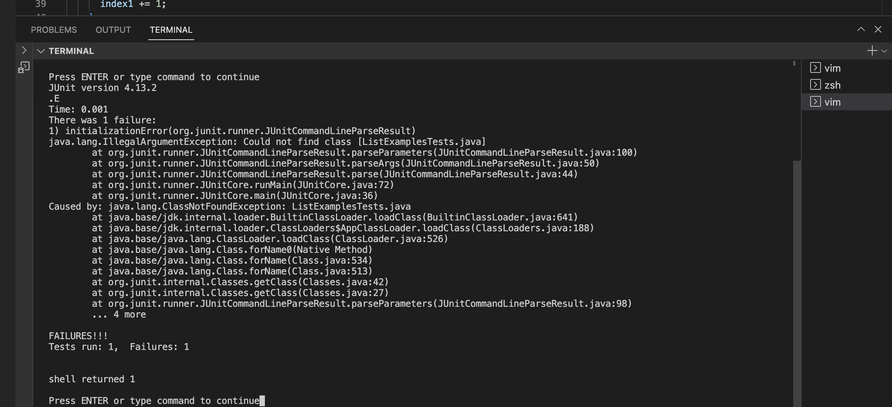
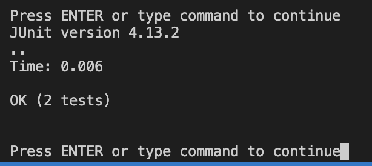

# Lab Report 4 Roy Lee

## Commands
### Step 4:  
Keys Pressed:(vim) <enter> (:) (!) <ctrl-v>    _`ssh cs15lfa23eo@ieng6.ucsd.edu` was copied onto my clipboard_ <enter> _This inputted the command into my terminal and exited me out of vim but logged me into eng6_  
### Step 5:  
(vim) <enter> (:) (!) <ctrl-v>   _The command that was copied onto my clipboard was ==git clone git@github.com:ucsd-cse15l-s23/lab7.git==_  

(vim) <enter> (:) (!) <ctrl+v> <enter> <enter> _This was the pasted from my clipboard javac -cp .:lib/hamcrest-core-1.3.jar:lib/junit-4.13.2.jar *.java_   (:) (!) <ctrl+v> <enter>  
Here I was going into the terminal in vim and compiling the tests  

javac -cp .:lib/hamcrest-core-1.3.jar:lib/junit-4.13.2.jar *.java  
java -cp .:lib/hamcrest-core-1.3.jar:lib/junit-4.13.2.jar org.junit.runner.JUnitCore ListExamplesTests  
I used these commands. 

(:) (edit) (ListExamples.java)  
Now I am opening the file ListExamples.java to get into the file and edit it. 

(down)(down)(down)(down)(down)(down)(down)(down)(down)(down)(down)(down)(down)(down)(down)(down)(down)(down)(down)(down)(down)(down)(down)(down)(down)(down)(down)(down)(down)(down)(down)(down)(down)(down)(down)(down)(down)(down)(down)(down)(down)(down)(down)
(right)(right)(right)(right)(right)(right)(right)(right)(right)(right)(right)  
Here I was navigating through the file  

(x)(a)(left)(2)  
This is the actual edits I made where I deleted a 1 and replaced it with a 2.  

(:)(wq)<enter>  
Saved the file and exited vim.  

(vim)  
Reopened vim editor  
(:) (!) (ctrl+v) <enter> (:) (!) (ctrl+v) <enter>  
And running the same tests again.

## Tests

