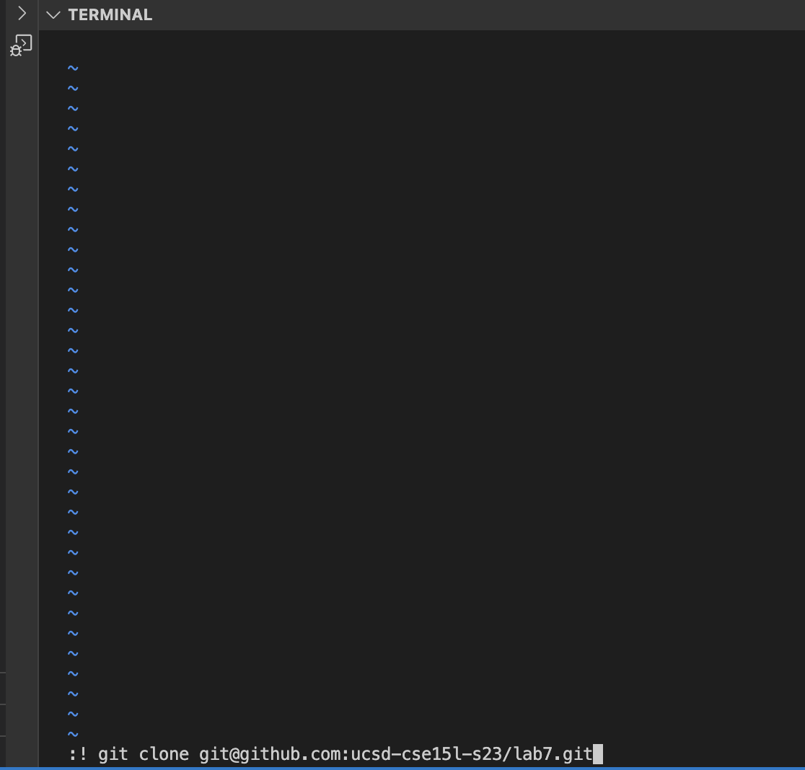

# Lab Report 4 Roy Lee

## Commands
### Step 4:  
Keys Pressed:`(vim)<enter>(:)(!)<ctrl+v><enter>`    _`ssh cs15lfa23eo@ieng6.ucsd.edu` was copied in my clipboard, after pressing enter the second time the command that I inputted ran in my terminal but exited me out of vim_  

### Step 5:  
Keys Pressed: `(vim)<enter>(:)(!)<ctrl-v><enter><enter<`   _`git clone git@github.com:ucsd-cse15l-s23/lab7.git` was copied in my clipboard_  

### Step 6:  
Keys Pressed: `(vim)<enter>(:)(cd)<space>(lab7)<enter>(:)(!)(bash)<space>(test.sh)<enter><enter>` 

### Step 7:  
Keys Pressed: `(:)(edit)(ListExamples.java)<14><j><21><l><x><left><x><left<x><20><h><29><j><11><l><x><i><2><esc>(:)(w)(q)<enter` 

### Step 8:  
Keys Pressed: `(vim)<enter>(:)(cd)<space>(lab7)<enter>(:)(!)(bash)<space>(test.sh)<enter><enter>` 

### Step 9:  
Keys Pressed: `(:)(!)(git)<space>(add)(ListExamples.java)<enter><enter>(:)(!)(git)<space>(commit)<space>(-m)<space>("bug fixed")<enter><enter>(:)(q)(!)` 

