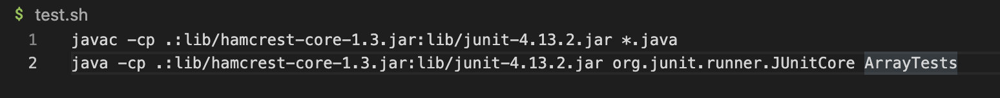

# Lab Report 5 Roy Lee
## Part 1
### Student Post
Hello, I am still having trouble finding the bugs in the ArrayExamples reversed method. Whenever I run the test script it does not output anything and times out. I believe that the issue may be within the for loop but I am unsure of how exactly I can fix it. Thanks!
```
for(int i = 1; i < arr.length; i += 0) {
      arr[i] = newArray[arr.length - i - 1];
    }
    return newArray;
```

### Tutor Response
You seem to be on the right track, I would double-check how this for-loop is initialized and incremented because it might be going in an infinite loop. Try instead of i+=0 maybe i++ to see if that will compile the file and result in an error message. Something else to look out for is how the elements are stored. Hope this helps!

### Student First Fix
After changing the i+=0 to i++ there is an error message that shows that the arrays are not reversed due to different elements being in the wrong arrangement. Now the bug is not completely fixed within the for-loop but there at least is an error message appearing. The first bug that causes the program to run infinitely is that because you are always incrementing by 0 after each loop is run, there will never be an end to the code's for-loop. The second is with the initialized value starting at 1, because i = 1 which means when the for loop runs through arr it always will skip the first element which is not supposed to happen. Lastly, is with array arrangement where in the buggy code it is taking elements of a new empty array reversing the values of an empty array, and inputting those elements into the parameter array, arr.


### Information
**Files & Directories Needed**: Currently in the working directory Lab3 <br>

**Content**:       <br>
**Command Line**: `bash test.sh` which holds the script of 
```
javac -cp .:lib/hamcrest-core-1.3.jar:lib/junit-4.13.2.jar *.java
java -cp .:lib/hamcrest-core-1.3.jar:lib/junit-4.13.2.jar org.junit.runner.JUnitCore ArrayTests
```
This runs the JUnit test which holds the test case of
```
public class ArrayTests {
  @Test
  public void testReversed() {
    int[] input1 = {3,2,1};
    assertArrayEquals(new int[]{1,2,3}, ArrayExamples.reversed(input1));
  }
```
This shows where I can find exactly at which element the loop may have failed, in the original buggy file there was no output because of the infinite loop. <br>

**Bug Fix**: To fix the three bugs you have to first change the increment statement in the for loop so that each loop does not increment by 0 but by 1, to do this you can change i+=0 to i++. Next, you have to start the loop at the first element changing the first part of the for loop from i = 1 to i = 0, that way when the for loop runs through the array arr it does not skip the first element. Lastly, within the for loop where it loops for each element in arr, there has to be a change within the inputted array and where the reversed elements are stored. Changing the arr and newArray in line 6 will solve this issue, where for each element of arr will be stored in a reversed order in newArray.
```
public class ArrayExamples {

  static int[] reversed(int[] arr) {
    int[] newArray = new int[arr.length];
    for(int i = 0; i < arr.length; i++) {
      newArray[i] = arr[arr.length - i - 1];
    }
    return newArray;
  }

}
```


## Part 2 Reflection
During this second part of the quarter overall my most enjoyable experience was using vim. At first, when we started to learn about it during lab I was genuinely so confused about why we were even learning it or how it can be useful at all in the future. But I got to learn several techniques and commands which in the end made me actually enjoy using it. It really advanced my knowledge of the terminal overall and hopefully, I get to use it in the future and at least have an idea of what I am doing. It was honestly one of the few things I have enjoyed learning about during my time in school and I am really glad that I did. I also really enjoyed just using the terminal, I haven't gotten much experience in any past classes utilizing the terminal to its full potential, so doing so in this class was really fun.
